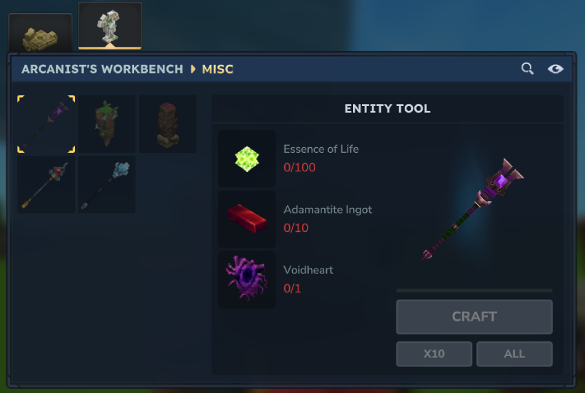

# Survival Entity Tool

A plugin that brings the Entity Tool to Survival Mode.

Build, decorate, and create custom structures using the same workflow as Creative Mode while staying fully within a survival playthrough.

Unlike the standard Entity Tool, all placed entities require actual resources, making it a survival-friendly building tool rather than a creative-only feature.

---
# How to Use

The Survival Entity Tool can be crafted at the Arcanist's Workbench using:
* 100 × Essence of Life
* 10 × Adamantite Ingots
* 1 × Voidheart

Items placed using the Entity Tool are consumed from your inventory and can be picked up again later, making the entire workflow fully survival compatible.

Build anything your imagination can come up with, without leaving Survival Mode.

---
# Contributing

Suggestions, ideas, and feedback are welcome.

---

# Socials

### X: [@MarggxDev](https://x.com/MarggxDev)

### Discord: [Marggx](https://discord.gg/Hx5jFT95)

---